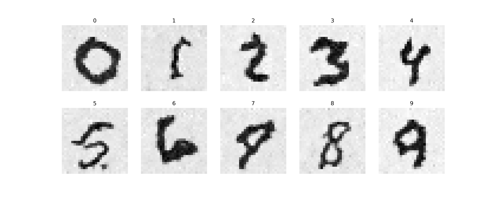

# Diffision Model 개념
## 전방 확산

$x(t+\Delta t) = x(t) + \sigma(t)\sqrt{\Delta t}\cdot r$

$\sigma$ = noise strength function  
$r$ = random variable  

## 역확산
$x(t+\Delta t) = x(t) + \sigma(T-t)^2\cdot s(x, T-t)\cdot \Delta t + \sigma(T-t)\sqrt{\Delta t}\cdot r$

$s(x, t) = \frac{d}{dx}\log{p}(x, t)$ = score function

$x_{0}=0$이고, $\sigma$가 일정하다면, $s(x, t) = -(x-x_{0})\sigma^{2}t = -x\sigma^{2}t$

## Training Goal
* score function을 알고 있으면, 역확산이 가능
* 그런데 실제로는 score function 알지 못함
* 그래서 Denoising network를 학습하는 과정에 score function을 배우게 할 것
* 즉 목표는, 확산 과정에서 모든 시간 $t$에 대해서, 그리고 모든 $x_0$에 대해서 샘플의 각 부분에 추가되는 노이즈의 양을 예측하는 것
* score function을 학습하는 것은 무작위 노이즈를 의미있는 것으로 변환하는 것

# 결과 샘플

